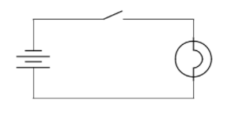
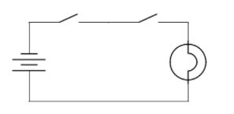
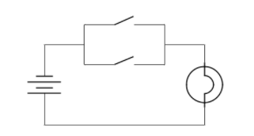
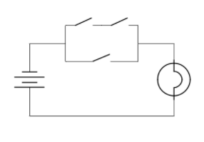
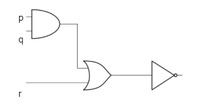
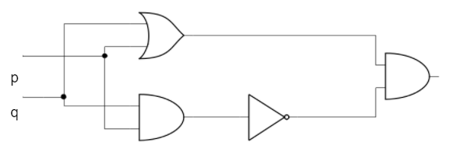
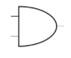
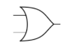
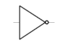

# general_py

## Python:
- Is general purpose programing language used for:
  - Web development server side
  - software development and workflows, data management
  - mathematics
  - system scripting
  - [src](https://www.w3schools.com/python/python_intro.asp).
- Python:
  - has a simple syntax that allows you to program in fewer lines of code.
  - is easy to learn
  - it can be both either functional and object-oriented
  - it is ideal for data mining and data facilitation
  - good community support
- Installation and setup:
  - Download [anaconda](https://www.anaconda.com/products/individual)
-Data Type:
  - Text type: str
  - Numeric Types: int, float, complex
  - Sequence Type: list, tuple, range
  - Mapping Type: dict
  - Set type: bool
  - Binary Types: bytes, bytearray, memoryview
  - [reference](https://docs.python.org/3/library/stdtypes.html?highlight=data%20types)
    - To get the datatype, use the type() function.
- Structure:
  - Python lets us split the program into modules that can be reused.
  - It is interpreted
  - It is extensible
- Start:
  - start by checking if you have python installed properly
  - `python --version`
  - `python` will launch python
  - to quit , type `quit()`
- Implementations:
  - CPython - written in C
  - JPython - Written in Java
  - Python for .NET - written in C but is a managed .NET application
  - IronPython - an alternative to Python.NET, providing availability to .NET libraries, also generate IL and compiles pyton code directly to .NET assemblies.
  - PyPy - written completely in Python.
- Notation:
  - modified BNF grammar notation
    - [BNF](http://www.cs.umsl.edu/~janikow/cs4280/bnf.pdf) or Backus-Naur Form is used to define syntax using:
      - a set of terminal symbols
      - a set of non-terminal symbols
      - a set of production rules of the form `Left-Hand-Side ::= Right-Hand-Side`
        - Left-hand side contains non terminal 
        - Right-hand side contains either terminal or non-terminal or both.
        
          - left-hand side can be replaced by the right-hand expression
          - syntactical correct sentences follow the above-mentioned order.
          - if a parse tree cannot be built to show the sentence derives from the production rules, the sentence is deemed syntactically incorrect.
          
  ####  Grammar:
      - A sentence can be well-formed but still meaningless.
      - Semantics will define the meaning.
    - [sources](https://docs.python.org/3/reference/introduction.html#implementations)
  #### Example
        - A grammar that recognizes exactly two strings `things are getting better` and `things are getting worse`
    
        ```
      
      
        things ::= "things are" condition
           condition ::= "getting better" | "getting worse"  
                           things
                           /     \
                          /       \
            "things are"          "condition"
                                       |
                                  "getting better"
      
      
        ```
        
```
car     ::= make
         |  car ", " make
make ::= "Ford" | "Toyota" | "BMW"
The string "Ford, Toyota, BMW, Toyota, Ford" is in the language because of the following parse tree:

                                 ________ car __________
                                /                \      \
                    _________ car ________        |    make
                   /               \      \       |      |
           ______ car _______       |      make   |      |
          /           \      \      |      |      |      |
     __ car __         |   make     |      |      |      |
    /    |    \        |      |     |      |      |      |
  car    |   make      |      |     |      |      |      |
   |     |      |      |      |     |      |      |      |
make     |      |      |      |     |      |      |      |
   |     |      |      |      |     |      |      |      |
"Ford" " , " "Toyota" ", " "BMW" ", " "Toyota" ", " "Ford"

```
#### Grammar for Empty language
`empty ::= `

#### Grammar for "olingthi"
- "olingthi" only takes an empty string as the only valid sentence in this language.

 `olingthi ::= ""`
 
- notice the difference between empty language and the empty string.

#### Grammar for a letter language

  `letter ::= "a" | "b" | "c" | "d" | ... | "z"`

```
letter ::= "a"
letter ::= "b"
letter ::= "c"
letter ::= "d"
...
letter ::= "z"
```
#### Defining a grammar for the word language
  `word ::= letter | word letter`

In this grammar featuring recursive rule, "water" is in this language
- "w" is a word (a sentence in the word language) because it is a letter 
- `word ::= letter`
- "wa" is a word because "w" is a word and "a" is a letter
- `word ::= word letter`
- "wat" is a word because "wa" is a word and "t" is a letter
- "wate" is a word because "wat" is a word and "e" is a letter
- ...

[reference](https://github.com/cs61)

- learn the [shell](https://linuxcommand.org/lc3_learning_the_shell.php)
- Bash Reference [Manual](https://www.gnu.org/savannah-checkouts/gnu/bash/manual/bash.html)
- 
#### Interpreter and its environment
- source files are treated as UTF-8 by default
- to change from  default encoding use: `-*- coding: encoding -*-` replacing 'encoding' with one of the valid [codecs](https://docs.python.org/3/library/codecs.html#standard-encodings)
- [Argument Passing](https://docs.python.org/3/tutorial/interpreter.html#argument-passing)
- script's name and its arguments are converted into a list and stored in the `argv` variable inside the `sys`
module `sys.argc[]`

#### Objects:
- used for data abstraction in Python
- abstraction is used as a productivity enhancer
#### Von Neumann model
- Is a form of computer organization based on the stored-program concept, it comprises the following components:
  - memory
  - CPU
  - Input
  - Output
  - Control unit
- Computer systems are organized as systemic set of transformations that brings a problem described in human language to the transistors that actually execute it.
  - you have a problem statement that explains what the issue is.
  - You then transform that into an algorithm
    - Procedural steps that ensure/guarantee precise execution by a computer.
    - The procedure must eventually terminate.
  - Algorithm is transformed into a computer program
  - ISA is the instruction set architecture available in every computer. It is a list of all instruction that a computer can execute and different computers might have different ISA. An example of ISA is x86.
  - A high level programming language such as Python is translated into specific ISA using a translating program called a compiler.
  - Low level programs written in low-level computer specif assembly language is translated using assembler
- Micro-architecture or the microprocessor architecture is a specific implementation if ISA in a given processor depending on the intended goals. For instance the x86 has been implemented slightly differently in Intel and AMD.
- List of Intel CPU [microarchitectures](https://en.wikipedia.org/wiki/List_of_Intel_CPU_microarchitectures)
- List of AMD [microarchitectures](https://en.wikichip.org/wiki/amd/microarchitectures)

At the root of the microarchitecture is the simple [logic circuit](https://circuitverse.org/simulator). You can learn more about logic gates [here](https://www.electronics-tutorials.ws/logic/logic_1.html)

It is also helpful to be have some knowledge of [binary numbers](https://www.electronics-tutorials.ws/binary/bin_1.html) and other [digital circuit Number Systems](https://drive.google.com/file/d/19G_eiyZ9HarpjZPlEYui4TGyVu4Ol_D1/view?usp=sharing)

AND `output = input1 ∧ input2` both are true
OR  `output = input1 ∨ input2` one or both are true

NOT `output = ∼ input1` the output is opposite of the input


<br>


<br> 


<br>


<br>


<br>


<br>

 AND `output = input1 ∧ input2` both are true
<br>

 OR  `output = input1 ∨ input2` one or both are true
<br>

 NOT `output = ∼ input1` the output is opposite of the input.
<br>

# Libraries.
### Machine learning
- [Scikit-Learn]()
- [TensorFlow]()
- [Pytorch]()
- [Theano]()
<br>

### Web Development
- [Django](https://www.djangoproject.com/)
- [Flask](https://palletsprojects.com/p/flask/)
- [Gunicorn](https://gunicorn.org/)
- [Celery](https://docs.celeryproject.org/en/stable/getting-started/introduction.html)
- [Bottle](https://bottlepy.org/docs/dev/)
- [Web2py](http://www.web2py.com/books/default/chapter/29/01/introduction)
- [Pyramid](https://trypyramid.com/)
- [FastAPI](https://fastapi.tiangolo.com/)
<br>

### Ethical Hacking

- [IMPacket](https://www.secureauth.com/labs/open-source-tools/impacket/)
- [Cryptography](https://cryptography.io/en/latest/)
- [Scapy](https://scapy.readthedocs.io/en/latest/)
- [pwntools](https://python3-pwntools.readthedocs.io/en/latest/)
- [Nmap](https://nmap.readthedocs.io/en/latest/nmap.html)
<br>

### Scraping

- [Scrapy](https://docs.scrapy.org/en/latest/intro/overview.html)
- [BeautifulSoup](https://beautiful-soup-4.readthedocs.io/en/latest/)
- [Selenium](https://selenium-python.readthedocs.io/)
- [Requests](https://docs.python-requests.org/en/master/index.html)
- [PyRobot](https://pyrobot.org/docs/overview)
- [Newspaper3k](https://newspaper.readthedocs.io/en/latest/)
<br>

### Game Development

- [Pygame](https://www.pygame.org/wiki/about)
- [Pyglet](https://docs.pyglet.org/en/latest/modules/pyglet.html)
- [Cocos2d](https://docs.cocos.com/creator/manual/en/)
- [panda3D](https://docs.panda3d.org/1.10/python/index)
<br>

### Image Processing

- [Pillow](https://pillow.readthedocs.io/en/stable/)
- [Scikit-Image](https://scikit-image.org/)
- [OpenCV](https://docs.opencv.org/4.x/d1/dfb/intro.html)
- [Pytesseract](https://github.com/madmaze/pytesseract)
<br>

### Mobile Development

- [Kivy](https://kivy.org/doc/stable/)
- [BeeWare](https://beeware.org/)
<br>

### Data Science

- [Scikit-Learn](https://scikit-learn.org/stable/index.html)
- [Theano](https://en.wikipedia.org/wiki/Theano_(software))
- [Scipy](https://scipy.org/)
- [Numpy](https://numpy.org/)
- [Pandas](https://pandas.pydata.org/)
- [Scrapy](https://docs.scrapy.org/en/latest/intro/tutorial.html)
<br>

### Desktop Applications

- [wxPython](https://wiki.wxpython.org/)
- [PyQT5](https://www.riverbankcomputing.com/software/pyqt/)
- [Pyside](https://wiki.qt.io/Qt_for_Python)
- [PySimpleGUI](https://pysimplegui.readthedocs.io/en/latest/)
<br>

### BioInformatics

- [BioPython](https://biopython.org/)
- [ProDy](http://prody.csb.pitt.edu/)
- [SciKit-Bio](http://scikit-bio.org/)
- [Pyensembl](https://pyensembl.readthedocs.io/en/latest/pyensembl.html)
- [PySB](https://pysb.org/)
<br>

### Mathematics and Computation

- [Theano](https://www.tutorialspoint.com/theano/index.htm)
- [Scipy](https://docs.scipy.org/doc/scipy/reference/)
- [Numpy](https://numpy.org/)
- [Statsmodels](https://www.statsmodels.org/stable/index.html)
- [CuPy](https://cupy.dev/)
- [SymPy](https://www.sympy.org/en/index.html)
<br>

### Testing and Automation

- [Robotframework](https://robotframework.org/)
- [Automate](https://automate.io/)
- [Pytest](https://docs.pytest.org/en/6.2.x/)
- [Nose](https://nose.readthedocs.io/en/latest/)
<br>

### Astronomy

- [SpacePy](https://github.com/spacepy/spacepy)
- [Astropy](https://docs.astropy.org/en/stable/)
- [SunPy](https://docs.sunpy.org/en/stable/)
<br>

### Data Visualization

- [Matplotlib](https://matplotlib.org/stable/index.html)
- [Seaborn](https://seaborn.pydata.org/)
- [Plotly](https://plotly.com/)
- [Bokeh](https://bokeh.org/)
- [Pydot](https://github.com/pydot/pydot)
<br>

### Robotics

- [RobotFramework](https://robotframework.org/)
- [Pydy](https://www.pydy.org/)
- [PyBotics](https://pybotics.readthedocs.io/en/latest/)
<br>

### Cryptocurrency

- [BitCoinLib](https://bitcoinlib.readthedocs.io/en/latest/index.html)
- [CCXT](https://docs.ccxt.com/en/latest/manual.html)
<br>

### Data Mining

- [Scrapy](https://scrapy.org/)
- [BeautifulSoup](https://www.crummy.com/software/BeautifulSoup/bs4/doc/)
- [Selenium](https://www.selenium.dev/documentation/)
<br>

### Computer Vision

- [OpenCV](https://opencv.org/opencv-free-course/)
- [Mahotas](https://mahotas.readthedocs.io/en/latest/)
- [SimpleCV](http://simplecv.org/)
<br>

### Quantum Computing

  - [QuTiP](https://qutip.org/)
  - [PyQuil](https://pyquil-docs.rigetti.com/en/stable/compiler.html)
  - [Cirq]()
  - [Qiskit](https://qiskit.org/)
<br>
  
### Statistical Computation

- [Pandas](https://pandas.pydata.org/)
- [Statsmodels](https://www.statsmodels.org/stable/index.html)
<br>

### Command Line Applications

- [Typer](https://typer.tiangolo.com/tutorial/first-steps/)
- [cmd2](https://cmd2.readthedocs.io/en/stable/)
- [Click](https://click.palletsprojects.com/en/7.x/)
<br>

### Signal Processing

- [Scipy](https://docs.scipy.org/doc/scipy/reference/tutorial/index.html)
- [PyWavelets](https://pywavelets.readthedocs.io/en/latest/)
<br>

### Interactive Computing

- [IPython](https://ipython.org/)
- [Jupyter Notebook](https://jupyter.org/)
<br>

### Deep Learning

- [TensorFlow](https://www.tensorflow.org/learn)
- [PyTorch](https://pytorch.org/)
- [Keras](https://keras.io/)
- [Chainer](https://chainer.org/)
<br>

### Geographic Processing

- [GeoPandas](https://geopandas.org/en/stable/)
- [Shapely](https://shapely.readthedocs.io/en/stable/project.html)
<br>

### Sciences

- [Scipy](https://scipy.org/)
- [Statsmodels](https://www.statsmodels.org/stable/index.html)
- [CuPy](https://cupy.dev/)
- [PsychoPy](https://www.psychopy.org/)
<br>

### Natural Language Processing

- [NLTK](https://www.nltk.org/)
- [TextBlob](https://pypi.org/project/textblob/)
- [Stanza](https://stanfordnlp.github.io/stanza/)
- [spaCY](https://spacy.io/)
- [Gensim](https://pypi.org/project/gensim/)
<br>

### Cybersecurity

- [IMPacket](https://www.kali.org/tools/impacket/)
- [Cryptography](https://cryptography.io/en/latest/)
- [Scrapy](https://pypi.org/project/Scrapy3/)
- [Twisted](https://pypi.org/project/Twisted/)
- [Faker](https://faker.readthedocs.io/en/master/)

## certifications
 - [Terraform](https://learn.hashicorp.com/collections/terraform/certification)
 - [Kubernetes](https://kubernetes.io/docs/tutorials/)
 - [Orchestration](https://www.redhat.com/en/topics/automation/what-is-orchestration)

## references
- [Digital circuits and Number Systems](https://www.math.umd.edu/~immortal/CMSC250/notes/notes_2.pdf)
- [programming and machine organization](https://cs61.seas.harvard.edu/site/2021/)
- [Introduction to Computing systems](https://users.ncsa.illinois.edu/kindr/teaching/ece190_sp11/lectures/)
- 
